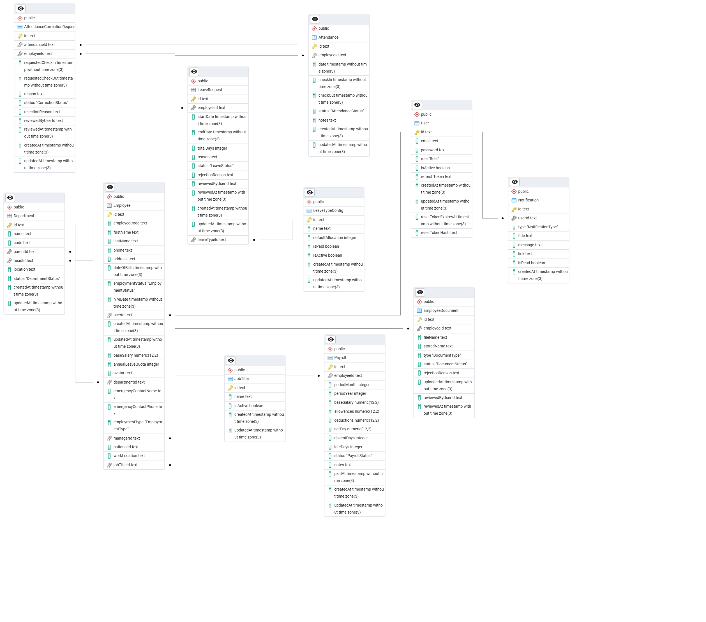

# KORU Backend

[](https://classroom.github.com/a/EdN1T4tj)

## Deployments

- **API:** [api.koru-hrm.site](https://api.koru-hrm.site) · Swagger docs at [api.koru-hrm.site/api/docs](https://api.koru-hrm.site/api/docs)
- **Frontend:** [www.koru-hrm.site](https://www.koru-hrm.site) — see the [koru-frontend](https://github.com/sconos/crack-fe-satria) repo for the Next.js app this API serves.

A NestJS-based HR and employee management backend for the KORU platform. The API handles authentication, employee records, departments, attendance, leave, payroll, public holiday management, document uploads, notifications, and reporting.

## Overview

This project is built with:

- NestJS
- TypeScript
- Prisma ORM
- PostgreSQL
- Swagger/OpenAPI
- Passport + JWT
- Multer for file uploads
- Resend for email delivery

## Features

- Role-based authentication and authorization
- Employee onboarding and profile management
- Department and job title management
- Attendance tracking and correction requests
- Leave request and approval workflow
- Payroll generation and payslip export
- Document upload and review flows
- Public holiday configuration
- Notification system
- Report generation endpoints
- Static upload serving for avatars and documents

## Project Structure

```bash
src/
├── app.module.ts
├── main.ts
├── auth/
├── attendances/
├── attendance-corrections/
├── departments/
├── documents/
├── email/
├── employees/
├── health/
├── job-title/
├── leave/
├── leave-types/
├── notifications/
├── payroll/
├── prisma/
├── public-holidays/
├── reports/
└── ...

prisma/
├── schema.prisma
├── seed.ts
└── migrations/

uploads/
├── avatars/
└── documents/
```

## Prerequisites

Before running the project, make sure you have installed:

- Node.js 20+
- npm
- PostgreSQL

## Installation

1. Clone the repository:

```bash
git clone https://github.com/sconos/crack-fe-satria.git
cd koru-backend
```

2. Install dependencies:

```bash
npm install
```

3. Create a PostgreSQL database and configure environment variables.

4. Generate Prisma client:

```bash
npx prisma generate
```

5. Run database migrations:

```bash
npx prisma migrate dev
```

6. Seed the database if needed:

```bash
npm run seed
```

## Environment Variables

Create a `.env` file in the project root with the following values:

```env
DATABASE_URL="postgresql://<username>:<password>@localhost:5432/koru?schema=public"
JWT_ACCESS_SECRET="<strong-random-access-secret>"
JWT_REFRESH_SECRET="<strong-random-refresh-secret>"
FRONTEND_URL="http://localhost:3000"
RESEND_API_KEY="<resend-api-key>"
EMAIL_FROM="Koru HRM <notifications@koru-hrm.site>"
PORT=4000
NODE_ENV="development"
```

Notes:

- `DATABASE_URL` must point to your PostgreSQL instance.
- `FRONTEND_URL` is used for password reset links (and should match the deployed frontend URL in production, e.g. `https://www.koru-hrm.site`).
- `JWT_ACCESS_SECRET` and `JWT_REFRESH_SECRET` should be long, random strings.

## Running the Application

Development mode:

```bash
npm run start:dev
```

Production build:

```bash
npm run build
npm run start:prod
```

The API starts on port `4000` by default unless `PORT` is set.

## API Documentation

Swagger documentation is available at:

```text
http://localhost:4000/api/docs
```

This includes the OpenAPI spec and authenticated endpoints for the backend.

## Authentication

The project uses JWT-based authentication with refresh token cookies.

Primary auth endpoints include:

- `POST /auth/bootstrap-admin`
- `POST /auth/login`
- `POST /auth/refresh`
- `POST /auth/logout`
- `POST /auth/forgot-password`
- `POST /auth/reset-password`

Protected routes require a bearer token in the `Authorization` header.

## Common Development Commands

```bash
npm run start
npm run start:dev
npm run build
npm run test
npm run test:e2e
npm run lint
npm run seed
```

## Database

Prisma is configured in `prisma/schema.prisma` and uses PostgreSQL. Database migrations are stored under `prisma/migrations/`.

### ERD



Useful commands:

```bash
npx prisma studio
npx prisma migrate dev
npx prisma migrate reset
npx prisma generate
```

## Notes

- Static avatar uploads are served from `/uploads/avatars/`.
- Document uploads are stored under `uploads/documents/`.
- Email sending is configured through Resend and can be disabled or mocked in local development depending on the environment.

## License

This project is for educational and internal business use within the current assignment/workspace context. No open-source license is granted.